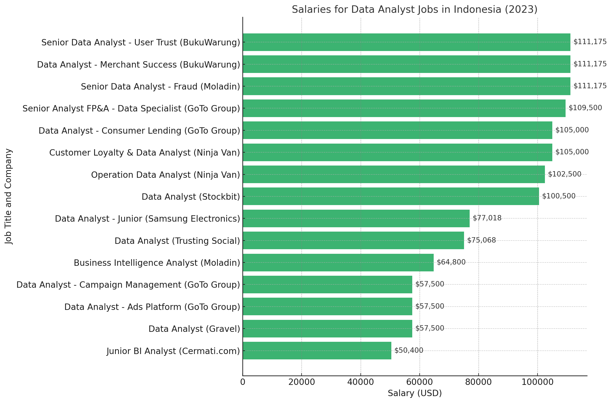

# Introduction
📊 Explore the data job market! This project focuses on data analyst roles, uncovering top-paying positions, in-demand skills, and the intersection of high demand and high salaries in data analytics.

🔍 My SQL queries are stored here: [project_sql folder](/Project_sql/)

# Background
This project emerged from a desire to navigate the data analyst job market more effectively, aiming to identify lucrative roles and the skills needed for success. The goal is to simplify the job search for others by highlighting optimal career paths.

Data is sourced from Luke Barousse's [SQL Course](https://lukebarousse.com/sql). providing valuable insights on job titles, salaries, locations, and essential skills.

### The questions I wanted to answer through my SQL queries were:

1. What are the highest-paying data analyst jobs?
2. What skills are essential for securing these top-paying positions?
3. Which skills are most sought after in the data analyst field?
4. What skills correlate with higher salaries?
5. Which skills should aspiring data analysts prioritize learning

# Tools I Used
To explore the data analyst job market in depth, I utilized a suite of essential tools:

- **SQL:** The foundation of my analysis, enabling me to query the database and extract valuable insights.
- **PostgreSQL:** The selected database management system, perfectly suited for managing job posting data.
- **Visual Studio Code:** My primary environment for database management and executing SQL queries.
- **Git & GitHub:** Crucial for version control and sharing my SQL scripts, facilitating collaboration and project tracking.

# The Analysis
Each query for this project aimed at investigating specific aspects of the data analyst job market. Here’s how I approached each question:

## 1. Top Paying Data Analyst Jobs
To identify the highest-paying roles, I filtered data analyst positions by average yearly salary and location, focusing on jobs that are in Indonesia. This query highlights all of the opportunities in the field.
```sql
SELECT
    job_postings_fact.job_id,
    job_postings_fact.job_title,
    job_postings_fact.job_location,
    job_postings_fact.job_schedule_type,
    job_postings_fact.salary_year_avg,
    job_postings_fact.job_country,
    job_postings_fact.job_posted_date,
    company_dim.name AS company_name
FROM
    job_postings_fact
LEFT JOIN
    company_dim
    ON job_postings_fact.company_id = company_dim.company_id
WHERE
    job_title LIKE '%Data Analyst%' 
    AND (job_postings_fact.job_location LIKE '%Indonesia%' OR job_country = 'Indonesia')
    AND salary_year_avg IS NOT NULL
ORDER BY
    salary_year_avg DESC;
```

### Top 10 Highest-Paying Data Analyst Roles

| Job ID   | Job Title                                          | Company Name     | Location                                                | Schedule Type | Average Salary (USD) | Posted Date          |
|----------|----------------------------------------------------|------------------|---------------------------------------------------------|---------------|----------------------|----------------------|
| 1146075  | Senior Data Analyst - User Trust                   | BukuWarung       | Jakarta, Indonesia                                      | Full-time     | 111,175.0            | 2023-02-03 19:39:23  |
| 714818   | Senior Data Analyst - Fraud                         | Moladin          | South Jakarta, Jakarta, Indonesia                       | Full-time     | 111,175.0            | 2023-07-05 19:19:23  |
| 176019   | Data Analyst - Merchant Success                     | BukuWarung       | Jakarta, Indonesia                                      | Full-time     | 111,175.0            | 2023-02-03 12:39:23  |
| 1516589  | Customer Loyalty SLA Control Tower & Data Analyst   | Ninja Van        | Jakarta, Indonesia                                      | Contractor     | 105,000.0            | 2023-08-14 07:17:07  |
| 413113   | Data Analyst - Consumer Lending                     | GoTo Group       | Jakarta, Indonesia                                      | Full-time     | 105,000.0            | 2023-08-30 02:37:44  |
| 869889   | (Operation) Data Analyst Manual Activity            | Ninja Van        | Yogyakarta, Indonesia                                    | Full-time     | 102,500.0            | 2023-04-05 07:18:38  |
| 1367719  | Data Analyst                                        | Stockbit         | Jakarta, Indonesia                                      | Full-time     | 100,500.0            | 2023-06-08 18:37:59  |
| 1467344  | Data Analyst - Junior                               | Samsung Electronics| Indonesia                                               | Full-time     | 77,017.5             | 2023-12-15 11:38:16  |
| 182865   | Data Analyst                                        | Trusting Social   | Jakarta, Indonesia                                      | Full-time     | 75,067.5             | 2023-12-22 21:17:34  |
| 1110700  | Data Analyst (Junior/Entry-level) - Campaign Management | GoTo Group   | Jakarta, Indonesia                                      | Full-time     | 57,500.0             | 2023-08-24 17:33:21  |

### Insights

1. **High Salary Range**:
   - The highest-paying roles range from **$111,175** for senior positions to **$57,500** for entry-level positions, showcasing a diverse salary landscape in the field.

2. **Company Diversity**:
   - Top companies offering these roles include **BukuWarung**, **Moladin**, and **Ninja Van**, indicating strong demand across various sectors such as fintech, automotive, and logistics.

3. **Job Types**:
   - The majority of these positions are full-time, with a mix of contractor roles, reflecting the need for stable employment in data analytics.

4. **Focus on Senior Roles**:
   - There is a notable demand for senior roles, particularly in user trust and fraud analysis, highlighting the importance of advanced skills in data analytics.

5. **Location Significance**:
   - Jakarta stands out as a key hub for data analyst opportunities, emphasizing the city's role in Indonesia's tech and finance industries.


*Bar graph visualizing the salary for data analysts in Indonesia; I used Python for this visualization.*


## 2. Skills for Top Paying Jobs
To understand what skills are required for the top-paying jobs, I joined the job postings with the skills data, providing insights into what employers value for high-compensation roles.
```sql
WITH top_paying_jobs AS (SELECT
    job_postings_fact.job_id,
    job_postings_fact.job_title,
    job_postings_fact.salary_year_avg,
    job_postings_fact.job_country,
    company_dim.name AS company_name
FROM
    job_postings_fact
LEFT JOIN
    company_dim
    ON job_postings_fact.company_id = company_dim.company_id
WHERE
    job_title LIKE '%Data Analyst%' 
    AND (job_postings_fact.job_location LIKE '%Indonesia%' OR job_country = 'Indonesia')
    AND salary_year_avg IS NOT NULL
ORDER BY
    salary_year_avg DESC
)

SELECT 
    top_paying_jobs.*,
    skills
FROM top_paying_jobs
INNER JOIN skills_job_dim ON top_paying_jobs.job_id = skills_job_dim.job_id
INNER JOIN skills_dim ON skills_job_dim.skill_id = skills_dim.skill_id
ORDER BY
    salary_year_avg DESC
```

### Recurring Skills in High-Paying Roles
- **SQL**: 
  - The most frequently listed skill across various roles and companies, appearing multiple times in positions at **BukuWarung** and **Moladin**. 
  - Indicates that SQL is a fundamental and highly-valued skill for senior-level data analysts.

- **Python**: 
  - The next most commonly required skill, prevalent in roles related to fraud detection and user trust analysis.
  - Shows the necessity of advanced programming for statistical analysis and machine learning tasks.

- **R**: 
  - Mentioned particularly in roles at **BukuWarung** and **Moladin**, signaling the importance of statistical computing knowledge in high-paying positions.

- **SAS**: 
  - Noted in fraud detection roles at **Moladin**, indicating that specific industries may prefer specialized tools for large-scale data handling.

### High Demand Across Industries
- Both **Moladin** (an automotive marketplace) and **BukuWarung** (a fintech startup) offer the same high average annual salary of **$111,175** for senior data analyst roles. 
- This suggests a strong demand for advanced data analysis skills across different sectors, beyond just tech or e-commerce.

###  Specialization Trends
- **Fraud Detection Roles**:
  - Require a wider variety of skills, including SQL, Python, R, and SAS, highlighting the need for versatility in managing different types of data and analysis tools.

- **User Trust and Merchant Success Roles**:
  - Focus more on SQL and Python, emphasizing the importance of data querying and analysis for improving customer relations and platform trustworthiness.

###  Key Takeaways
- **Master SQL**: It is a fundamental requirement across most high-paying roles, making it essential for any aspiring data analyst.
- **Learn Python**: A close second in demand, especially in roles that involve fraud detection and user trust.
- **Explore R and SAS**: Valuable in specialized roles like fraud detection, which require deeper statistical analysis or large-scale data processing.

## 3. In-Demand Skills for Data Analysts

This query helped identify the skills most frequently requested in job postings, directing focus to areas with high demand.

```sql
SELECT 
    skills,
    count(skills_job_dim.job_id) AS demand_count
FROM job_postings_fact
INNER JOIN skills_job_dim ON job_postings_fact.job_id = skills_job_dim.job_id
INNER JOIN skills_dim ON skills_job_dim.skill_id = skills_dim.skill_id
WHERE
    job_title LIKE '%Data Analyst%'
    AND (job_postings_fact.job_location LIKE '%Indonesia%' OR job_country = 'Indonesia')
GROUP BY
    skills
ORDER BY
    demand_count DESC
LIMIT 5;
```  
Here's the breakdown of the most demanded skills for data analysts in Indonesia in 2023

| Skill    | Demand Count |
|----------|--------------|
| SQL      | 214          |
| Python   | 148          |
| Excel    | 122          |
| Tableau  | 109          |
| R        | 82           |

*Table of the demand for the top 5 skills in data analyst job postings*

### Key Takeaways
- **SQL** remains the most sought-after skill, highlighting its foundational role in data analysis.
- **Python** and **Excel** follow closely, indicating the need for programming and spreadsheet skills in data tasks.
- **Tableau** is valued for data visualization, while R continues to be important for statistical analysis, although it has a lower demand count compared to others.

## 4. Skills Based on Salary
Exploring the average salaries associated with different skills revealed which skills are the highest paying.
```sql
SELECT 
    skills,
    ROUND(AVG(salary_year_avg), 0) AS avg_salary
FROM job_postings_fact
INNER JOIN skills_job_dim ON job_postings_fact.job_id = skills_job_dim.job_id
INNER JOIN skills_dim ON skills_job_dim.skill_id = skills_dim.skill_id
WHERE
    job_title_short = 'Data Analyst'
    AND salary_year_avg IS NOT NULL
    AND job_work_from_home = True 
GROUP BY
    skills
ORDER BY
    avg_salary DESC
LIMIT 25;
```
Here's a breakdown of the results for top paying skills for Data Analysts:
- **High Demand for Big Data & ML Skills:** Top salaries are commanded by analysts skilled in big data technologies (PySpark, Couchbase), machine learning tools (DataRobot, Jupyter), and Python libraries (Pandas, NumPy), reflecting the industry's high valuation of data processing and predictive modeling capabilities.
- **Software Development & Deployment Proficiency:** Knowledge in development and deployment tools (GitLab, Kubernetes, Airflow) indicates a lucrative crossover between data analysis and engineering, with a premium on skills that facilitate automation and efficient data pipeline management.
- **Cloud Computing Expertise:** Familiarity with cloud and data engineering tools (Elasticsearch, Databricks, GCP) underscores the growing importance of cloud-based analytics environments, suggesting that cloud proficiency significantly boosts earning potential in data analytics.

| Skills        | Average Salary ($) |
|---------------|-------------------:|
| pyspark       |            208,172 |
| bitbucket     |            189,155 |
| couchbase     |            160,515 |
| watson        |            160,515 |
| datarobot     |            155,486 |
| gitlab        |            154,500 |
| swift         |            153,750 |
| jupyter       |            152,777 |
| pandas        |            151,821 |
| elasticsearch |            145,000 |

*Table of the average salary for the top 10 paying skills for data analysts*

## 5. Most Optimal Skills to Learn
Combining insights from demand and salary data, this query aimed to pinpoint skills that are both in high demand and have high salaries, offering a strategic focus for skill development.

```sql
WITH skills_demand AS (
    SELECT 
    skills_dim.skill_id,
    skills_dim.skills,
    count(skills_job_dim.job_id) AS demand_count
FROM job_postings_fact
INNER JOIN skills_job_dim ON job_postings_fact.job_id = skills_job_dim.job_id
INNER JOIN skills_dim ON skills_job_dim.skill_id = skills_dim.skill_id
WHERE
    job_title LIKE '%Data Analyst%' 
    AND salary_year_avg IS NOT NULL
    AND (job_postings_fact.job_location LIKE '%Indonesia%' OR job_country = 'Indonesia')
GROUP BY
    skills_dim.skill_id
), average_salary AS (
    SELECT 
    skills_job_dim.skill_id,
    ROUND(AVG(salary_year_avg), 0) AS avg_salary
FROM job_postings_fact
INNER JOIN skills_job_dim ON job_postings_fact.job_id = skills_job_dim.job_id
INNER JOIN skills_dim ON skills_job_dim.skill_id = skills_dim.skill_id
WHERE
    job_title LIKE '%Data Analyst%'
    AND salary_year_avg IS NOT NULL
    AND (job_postings_fact.job_location LIKE '%Indonesia%' OR job_country = 'Indonesia')
GROUP BY
    skills_job_dim.skill_id
)

SELECT
    skills_demand.skill_id,
    skills_demand.skills,
    demand_count,
    avg_salary
FROM
    skills_demand
INNER JOIN average_salary ON skills_demand.skill_id = average_salary.skill_id
ORDER BY
    avg_salary DESC,
    demand_count DESC
```
Here's a breakdown of the most optimal skills for Data Analysts in 2023 based on demand and average salary:

| Skill        | Demand Count | Average Salary |
|--------------|--------------|----------------|
| SQL          | 9            | $94,568        |
| Python       | 8            | $88,201        |
| R            | 5            | $93,219        |
| Excel        | 4            | $89,896        |
| Tableau      | 2            | $102,750       |
| BigQuery     | 2            | $57,500        |
| SAS          | 2            | $111,175       |
| Looker       | 1            | $105,000       |
| AWS          | 1            | $77,018        |
| Hadoop       | 1            | $75,068        |
| GitLab       | 1            | $57,500        |
| Asana        | 1            | $57,500        |
| Slack        | 1            | $57,500        |

*Table of the most optimal skills for data analyst sorted by salary*

### Key Insights

- **High-Demand Programming Languages:** SQL and Python stand out for their high demand, with demand counts of 9 and 8 respectively. The average salary for SQL is $94,568, while Python offers $88,201, indicating that proficiency in these languages is highly valued.

- **Statistical and Data Analysis Tools:** R shows significant demand with a count of 5 and an average salary of $93,219, highlighting its importance in data analysis tasks.

- **Business Intelligence and Visualization Tools:** Tableau and Looker demonstrate critical roles in data visualization, with demand counts of 2 and average salaries of $102,750 and $105,000, respectively. This emphasizes the need for skills in deriving actionable insights from data.

- **Emerging Technologies:** Skills in cloud platforms and big data technologies such as AWS, Hadoop, and BigQuery reflect the growing importance of cloud computing in data analysis. AWS has an average salary of $77,018, while BigQuery is at $57,500, indicating a market trend towards these technologies.

- **Collaboration Tools:** Skills in tools like GitLab, Asana, and Slack, while having lower demand counts, emphasize the need for collaboration in data projects, with an average salary of $57,500 each.

# What I Learned

This experience has significantly enhanced my SQL capabilities:

- 🧩 **Advanced Query Development**: I’ve developed a strong command of complex SQL queries, skillfully combining tables and effectively using WITH clauses for temporary tables.
- 📊 **Proficient Data Aggregation**: I’ve become skilled in using GROUP BY, turning aggregate functions like COUNT() and AVG() into essential tools for summarizing data.
- 💡 **Enhanced Analytical Skills**: I’ve sharpened my ability to tackle real-world challenges, translating questions into practical and insightful SQL queries.

# Conclusions

### Closing Thoughts

This project enhanced my SQL skills and provided valuable insights into the data analyst job market. The findings from the analysis serve as a guide to prioritizing skill development and job search efforts. Aspiring data analysts can better position themselves in a competitive job market by focusing on high-demand, high-salary skills. This exploration highlights the importance of continuous learning and adaptation to emerging trends in the field of data analytics.


[def]: assets\salaries_for_data_analyst_in_Indonesia.png
